# Documentación CRUD con cURL

## CREATE - Crear estudiante con POST

- Recibe objeto con datos del estudiante e imprime el comando de POST
    ```bash
    curl -i -X POST "http://localhost:4000/students" \
        -H "Content-Type: application/json" \
        -d '{
            "id":"8",
            "name":"Claudia Solera Solana",
            "email":"claudiasolera@email.com",
            "enrollmentDate":"2025-10-05",
            "active":true,
            "level":"beginner"
        }'
    ```
- Explicación detallada de cada parte del comando:
    - ¿Qué hace cada flag?
        - -i es para que muestre la cabecera de respuesta.
        - -H sirve para enviar cabeceras HTTP.
        - -X es para especificar el método HTTP.
        - -d se usa para los datos del cuerpo de la petición.
    - ¿Por qué se usa ese método HTTP?
        - En este caso se usa el comando POST porque queremos crear un nuevo recurso, un nuevo estudiante.
    - ¿Qué headers se envían y por qué?
        - -H "Content-Type: application/json" : Le dice al servidor que enviamos datos en formato JSON.
- Respuesta HTTP real obtenida
    - Con la terminal bash:
        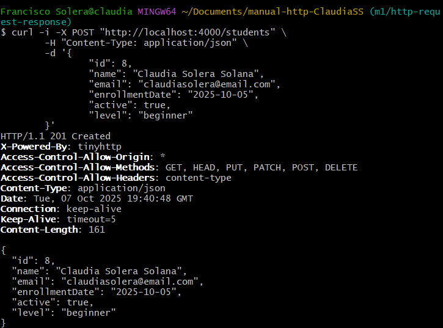
        - El código de estado 201 Created indica que la solicitud POST fue procesada correctamente y que se ha creado un nuevo recurso en el servidor, en este caso, el estudiante.
    - Con Thunder Client:
        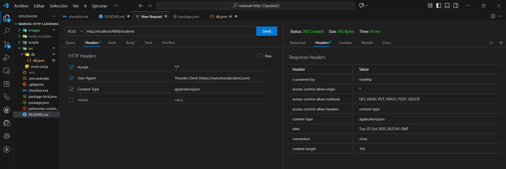
        - Aquí se muestran los headers que se han introducido por la consulta y los que muestra el resultado.
        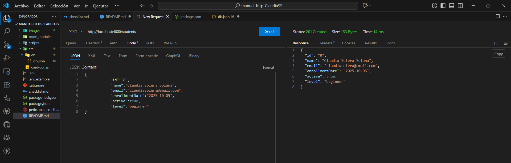
        - Aquí se muestra el body con los datos para crear el nuevo estudiante.

---

## READ ALL - Leer los datos de todos los estudiantes

- Imprime comando para leer todos los estudiantes (sin parámetros)
    ```bash
    curl -i -X GET "http://localhost:4000/students"
    ```
- Explicación detallada de cada parte del comando:
    - ¿Qué hace cada flag?
        - -i es para que muestre la cabecera de respuesta.
        - -X es para especificar el método HTTP.
    - ¿Por qué se usa ese método HTTP?
        - En este caso se usa el comando GET porque queremos obtener datos, los de todos los estudiantes.
- Respuesta HTTP real obtenida:
    - Con la terminal bash:
        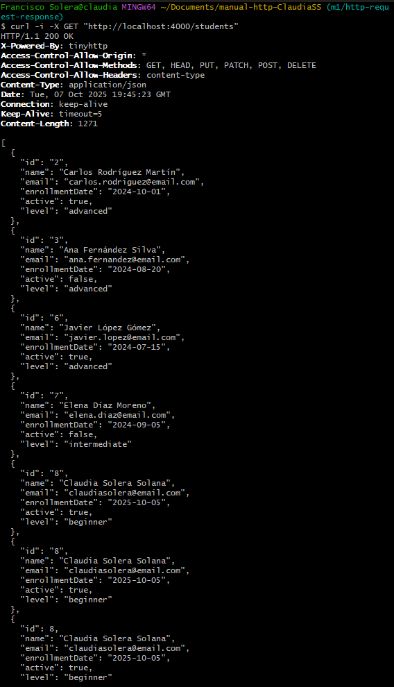
        - El código de estado 200 OK significa que la solicitud se procesó correctamente y el servidor devolvió un resultado válido.
    - Con Thunder Client:
        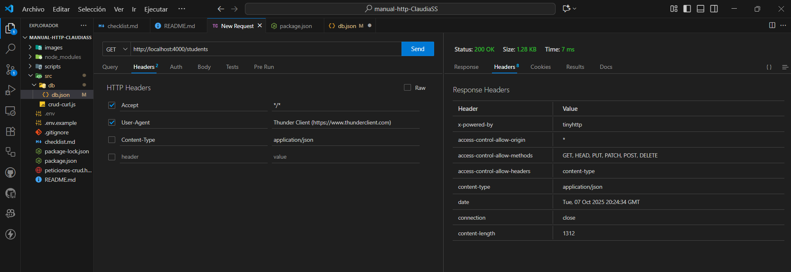
        - Aquí se muestran los headers que se han introducido por la consulta y los que muestra el resultado.
        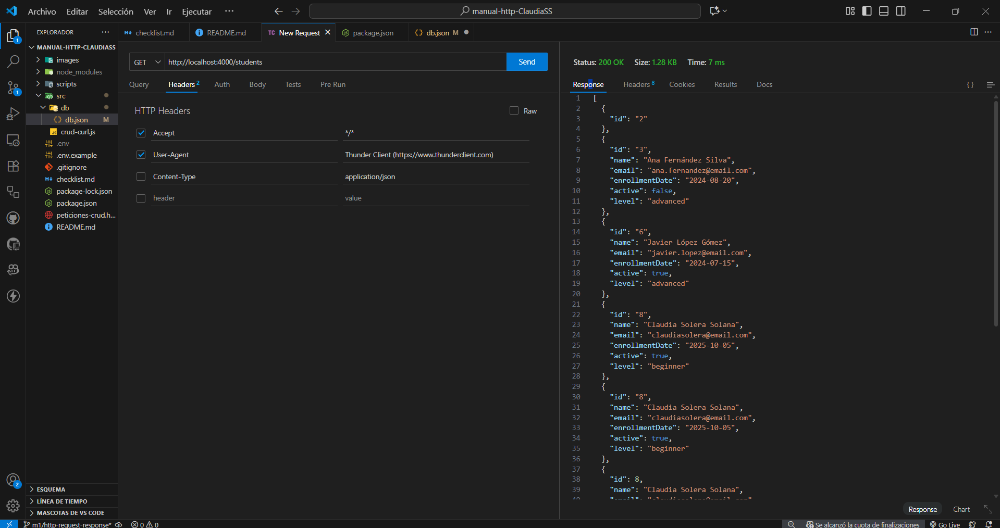
        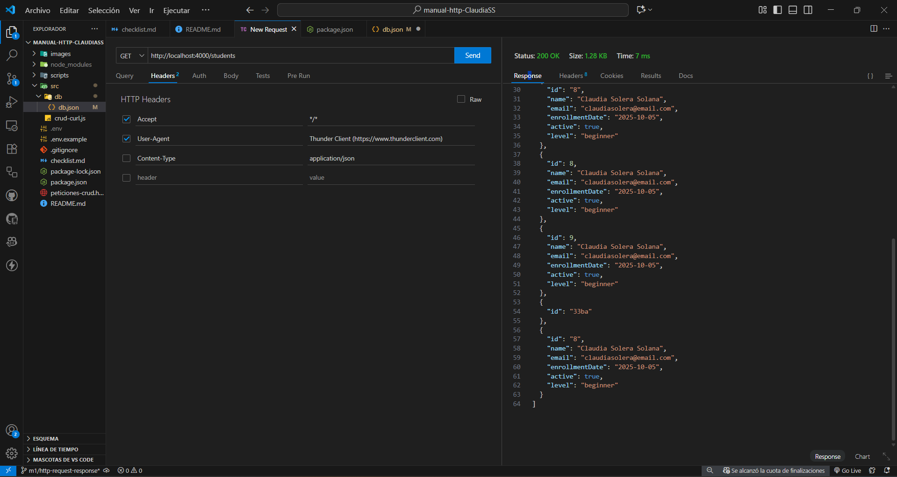
        - Aquí se muestra el resultado con la lista de todos los estudiantes.

---

## READ BY ID - Leer los datos de un estudiante por su ID

- Recibe el ID del estudiante e imprime comando para leerlo.
    ```bash
    curl -i -X GET "http://localhost:4000/students/7"
    ```
- Explicación detallada de cada parte del comando:
    - ¿Qué hace cada flag?
        - -i es para que muestre la cabecera de respuesta.
        - -X es para especificar el método HTTP.
- ¿Por qué se usa ese método HTTP?
        - En este caso se usa el comando GET porque queremos obtener datos, los del estudiante con ID = 7.
- Respuesta HTTP real obtenida
    - Con la terminal bash:
        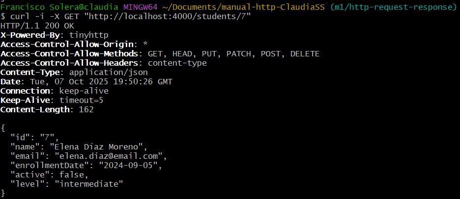
        - El código de estado 200 OK significa que la solicitud se procesó correctamente y el servidor devolvió un resultado válido.
    - Con Thunder Client:
        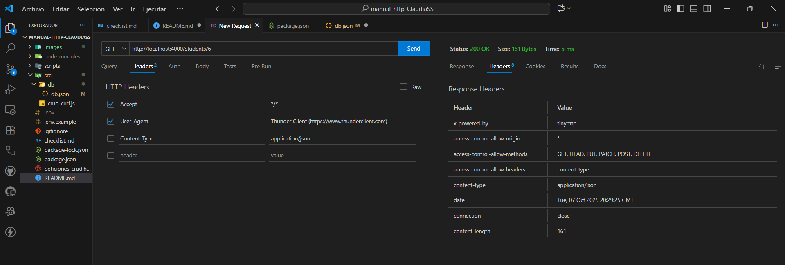
        - Aquí se muestran los headers que se han introducido por la consulta y los que muestra el resultado.
        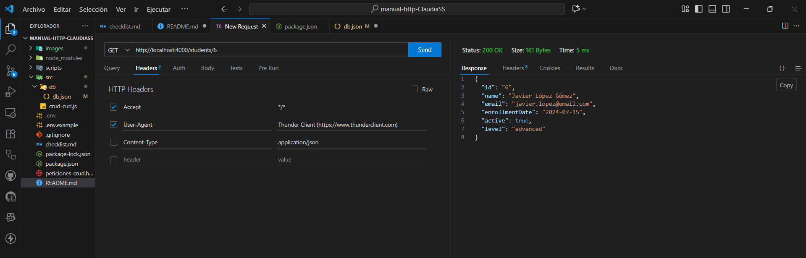
        - Aquí se muestra el resultado con la lista del estudiante con el id correspondiente introducido.

---

## UPDATE - Actualiza todos los datos

- Recibe el ID y datos completos e imprime el comando PUT.
    ```bash
    curl -i -X PUT "http://localhost:4000/students/2" 
        -H "Content-Type: application/json" 
        -d '{
            "id":"2",
            "name":"María García López",
            "email":"maria.garcia@email.com",
            "enrollmentDate":"2024-10-10",
            "active":false,
            "level":"advanced"
        }'
    ```
- Explicación detallada de cada parte del comando:
    - ¿Qué hace cada flag?
        - -i es para que muestre la cabecera de respuesta.
        - -H sirve para enviar cabeceras HTTP.
        - -X es para especificar el método HTTP.
        - -d se usa para los datos del cuerpo de la petición.
    - ¿Por qué se usa ese método HTTP?
        - En este caso se usa el comando PUT porque queremos reemplazar un recurso completo.
    - ¿Qué headers se envían y por qué?
        - -H "Content-Type: application/json" : Le dice al servidor que enviamos datos en formato JSON.
- Respuesta HTTP real obtenida
    - Con la terminal bash:
        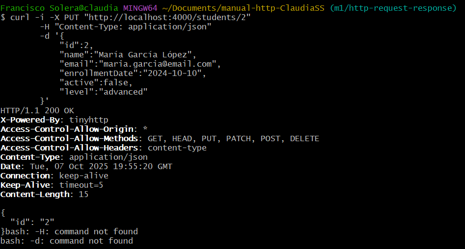
        - El código de estado 200 OK significa que la solicitud se procesó correctamente y el servidor devolvió un resultado válido.
    - Con Thunder Client:
        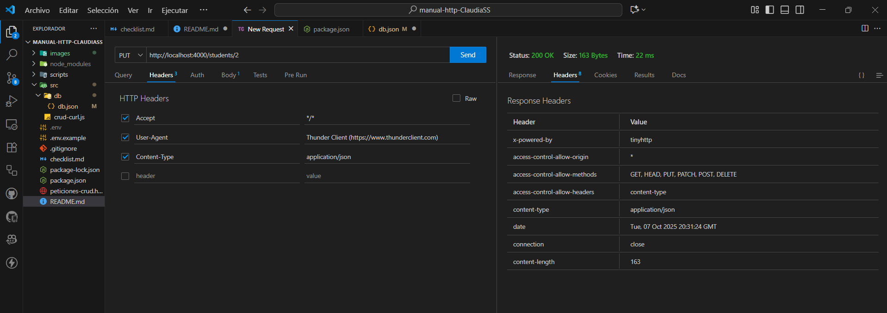
        - Aquí se muestran los headers que se han introducido por la consulta y los que muestra el resultado.
        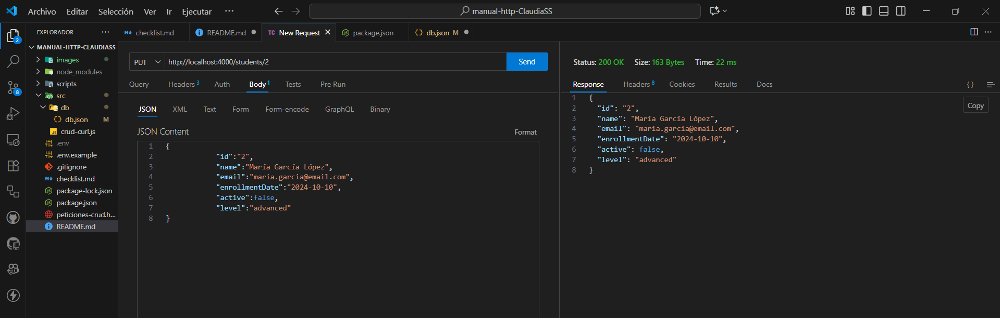
        - Aquí se muestra el resultado con el estudiante con id = 2 modificado.


---

## PATCH - Modifica parcialmente los datos

- Recibe el ID y datos parciales e imprime comando PATCH.
    ```bash
    curl -i -X PATCH "http://localhost:4000/students/2" 
        -H "Content-Type: application/json" 
        -d '{"level":"advanced"}'
    ```
- Explicación detallada de cada parte del comando:
    - ¿Qué hace cada flag?
        - -i es para que muestre la cabecera de respuesta.
        - -H sirve para enviar cabeceras HTTP.
        - -X es para especificar el método HTTP.
        - -d se usa para los datos del cuerpo de la petición.
    - ¿Por qué se usa ese método HTTP?
        - En este caso se usa el comando PATCH porque queremos modificar parcialmente los datos de un estudiante.
    - ¿Qué headers se envían y por qué?
        - -H "Content-Type: application/json" : Le dice al servidor que enviamos datos en formato JSON.
- Respuesta HTTP real obtenida
    - Con la terminal bash:
        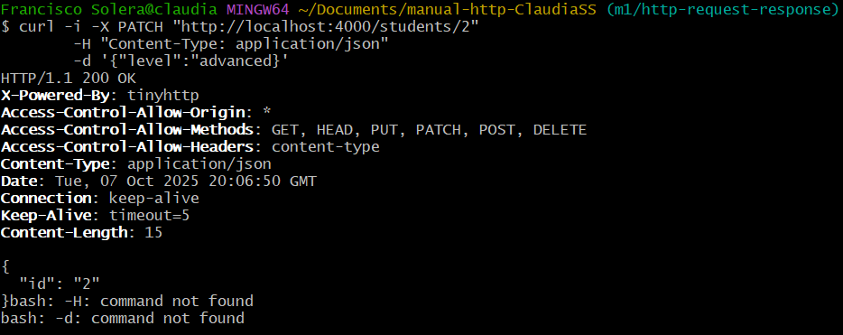
        - El código de estado 200 OK significa que la solicitud se procesó correctamente y el servidor devolvió un resultado válido.
    - Con Thunder Client:
        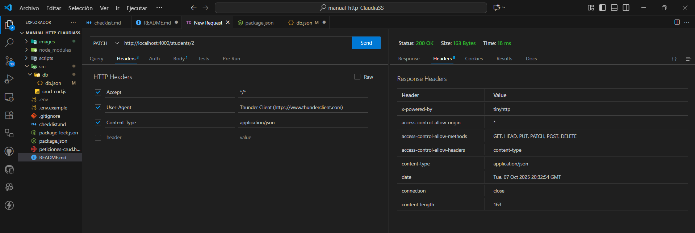
        - Aquí se muestran los headers que se han introducido por la consulta y los que muestra el resultado.
        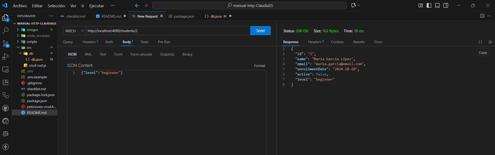
        - Aquí se muestra el resultado con el estudiante con id = 2 y el campo 'level' modificado.


---

## DELETE - Elimina un estudiante

- Recibe el ID del estudiante e imprime el comando DELETE.
    ```bash
    curl -i -X DELETE "http://localhost:4000/students/5"
    ```
- Explicación detallada de cada parte del comando:
    - ¿Qué hace cada flag?
        - -i es para que muestre la cabecera de respuesta.
        - -X es para especificar el método HTTP.
    - ¿Por qué se usa ese método HTTP?
        - En este caso se usa el comando DELETE porque queremos eliminar un recurso, un estudiante.
- Respuesta HTTP real obtenida
    - Con la terminal bash:
        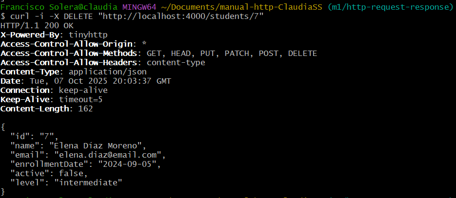
        - El código de estado 200 OK significa que la solicitud se procesó correctamente y el servidor devolvió un resultado válido.
    - Con Thunder Client:
        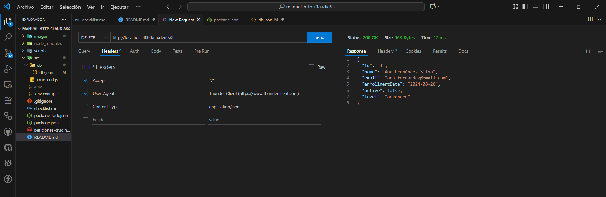
        - Aquí se muestra el resultado con el estudiante que se ha eliminado.
        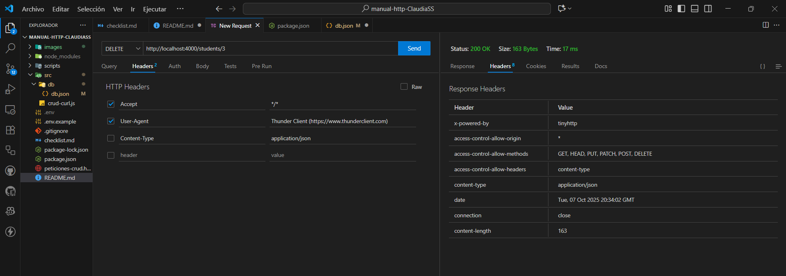
        - Aquí se muestran los headers que se han introducido por la consulta y los que muestra el resultado.

---

## Cómo usar Thunder Client
1) Pulsamos 'New Request'
2) Seleccionamos el método HTTP que vamos a usar (GET, POST, PUT, DELETE, etc.)
3) Escribimos la URL de la API que queremos probar
4) Si la petición lleva datos, los escribimos en la pestaña 'body'. Ejemplo:
    ```bash
    {
        "nombre": "Claudia",
        "email": "claudia@gmail.com"
    }
    ```
5) Pulsa 'Send' para enviar la petición HTTP y obtener el resultado correspondiente.